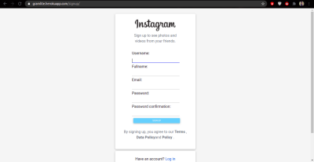
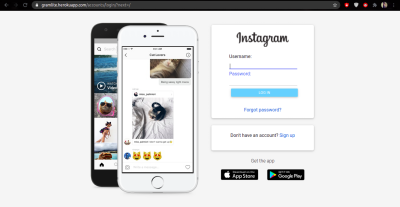
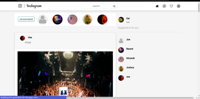
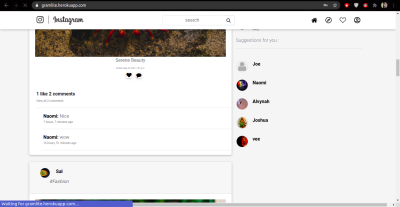
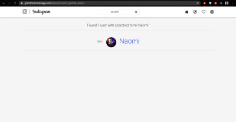
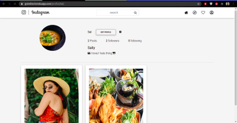
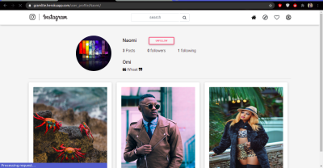
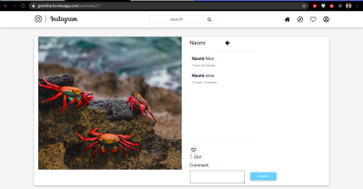

# Instagram Clone 

## Author
 [Alvynah Wabwoba](https://github.com/alvynah)

# Description
This is a Django web application. It is a clone of the instagram website. A user can upload images, follow and unfollow other users, like and unlike posts and visit their profiles as well as other users.The user can also search for a specific user.

## Screenshot
1. Log in and Sign up page

    

    

2. Landing page

    

    

3. Search by user 

    
    

4. Profiles
    * Own profile

    

    * Other users Profile

    
 

5. Add Comment

    

## Live Link
[gramlite](https://gramlite.herokuapp.com/)

## User Story

1. Sign in to the application to start using.
2. Upload my pictures to the application.
3. See my profile with all my pictures.
4. Follow other users and see their pictures on my timeline.
5. Like a picture and leave a comment on it.

## Behaviour Driven Development (BDD)

1. Sign up to the application

|Behaviour 	           |    Input 	                 |       Output          |
|----------------------------------------------|:-----------------------------------:|-----------------------------:|       
| Click on sign up under login form   | username,password,email | user account and profile is created  | 

2. log into the application 

|Behaviour 	           |    Input 	                 |       Output          |
|----------------------------------------------|:-----------------------------------:|-----------------------------:|       
| Enter details in the log in form   | username, password| Landing page is loaded is login is successful else an error message is shown  | 

3. See profiles 

|Behaviour 	           |    Input 	                 |       Output          |
|----------------------------------------------|:-----------------------------------:|-----------------------------:|       
| For user profile, click on the profile icon on navbar,or click on other users username | Username| User is redirected to the profile pages  |  

4. Follow and unfollow other users

|Behaviour 	           |    Input 	                 |       Output          |
|----------------------------------------------|:-----------------------------------:|-----------------------------:|       
| Click on button follow on their profiles | follow status| Increase number of followers by 1  | 

5. Like and unlike a post

|Behaviour 	           |    Input 	                 |       Output          |
|----------------------------------------------|:-----------------------------------:|-----------------------------:|       
| Click on like icon on a post  | like status| Increase number of likes by 1 else reduces the number of likes by 1  |

6. Comment on post

|Behaviour 	           |    Input 	                 |       Output          |
|----------------------------------------------|:-----------------------------------:|-----------------------------:|       
| Click on icon comment on the posts | comment| The added comment is displayed  |  

## Setup/Installation Requirements
### Getting the code
1. clone repository
    https://github.com/alvynah/instagram-clone.git
    
2. Move to the folder and install requirements
    cd instagram-clone
    pip install -r requirements.txt
### Database

1. Set up Database,and put your username and password in the code

2. Make migrations
    python3 manage.py makemigrations picture

3. Migrate
   python3 manage.py migrate 
    
### Running the Application
1. Run main apllication
   * python3 manage.py runserver

2. Run tests
    
   * python3.6 manage.py test picture

## Technologies Used

* Python3.6
* Django 3.2
* Bootstrap
* PostgreSQL
* CSS
* Heroku

## Contact Information
For any further inquiries or contributions or comments, reach me at [Alvynah](juvatalvynah@gmail.com)
### License
[MIT License](https://github.com/alvynah/GalleryZilla/blob/main/LICENSE)

Copyright (c) 2021 **Alvynah Wabwoba**